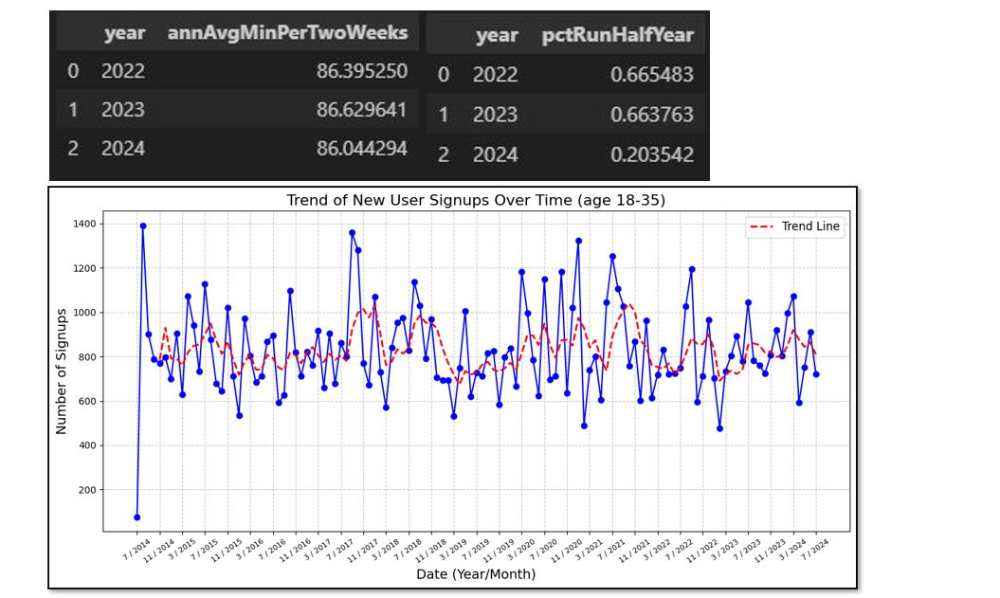
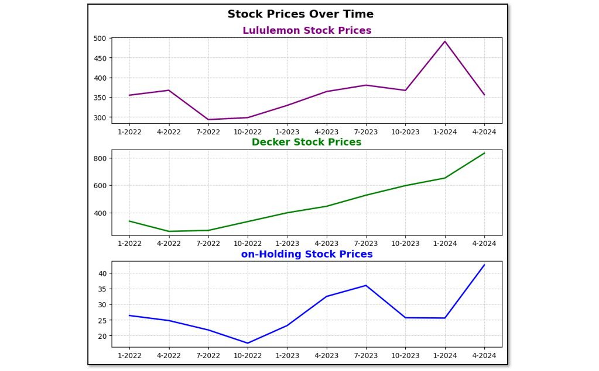

# Why is Running So Popular? - Overview
A deep-dive into the spontaneous rise in the popularity of running and the driving factors behind it.

## Research Question
Why has running seemingly become so popular recently, and can this be proven using quantitative methods?

## Background
This analysis uses a combination of LLM-generated user data and company-reported financial data, focusing on a hypothetical running app. The study investigates user trends and company financials to determine whether there is substantive evidence supporting the claim that running's popularity has sharply increased. By segmenting the data based on age, income, sex, and geography, we use key metrics to identify trends and insights.

## North Star Metrics
- **Growth:** Number of monthly signups
- **Engagement:** Average annual minutes run every two weeks
- **Engagement:** Number of annual active runners (posted activity 6 of 12 months)

## Summary of Insights
1. **Demographic Influence:** 
   - The perceived rise in popularity is not significantly influenced by age, geography, or sex.
   - There is a potential correlation with income, as a large increase in user signups among those with an annual income over $90,000 was observed starting in 2023. This aligns with the fact that running-branded companies often target the upper-middle class.

   
   
2. **Engagement Trends:**
   - Data shows no significant increase in engagement metrics, especially among the 18-35 age group.images\finding_one_pic.JPG
   - Despite a popular belief that Gen-Z (ages 12-27) drives the rise in running’s popularity, the data does not support this. However, there is an upward trend in new monthly signups that began in 2023.
   
   
   
3. **Financial Impact:**
   - Financial data from popular running and activewear companies suggests a sharp rise in investor sentiment starting in 2023, which corresponds with the perceived increase in running’s popularity.
   
    

## Recommendations and Next Steps
- **Income Segmentation:** 
   - The data suggests a correlation between higher income levels (annual income over $90,000) and the rise in running’s popularity. Further investigation into income segmentation is recommended, possibly defining 2-3 additional metrics to explore.
   
- **Broader Investigation:** 
   - Other factors worth exploring include the influence of social media presence and increased health and fitness awareness on the popularity of running. This would involve gathering more data and further segmentation relative to the defined north star metrics.
